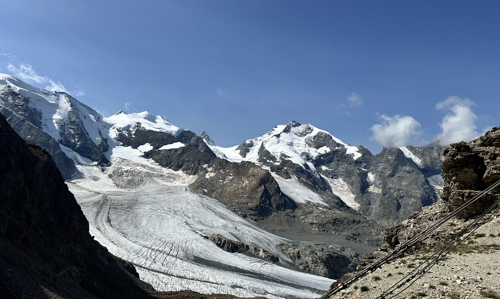

# Hi, I'm Noël 👋

Welcome to my profile! I’m passionate about computer science and computational science applications in the natural sciences as well as GIS, with a strong emphasis on earth and environmental systems.

---

## 🌲 About & Interests

Having worked with ETH research institutes (**WSL** and **SLF**), I developed a core passion for designing software and computational tools specifically for earth science applications. Furthermore I worked as a GIS engineer for ESRI Switzerland where I developed RAG-based geospatial applications. 

### Connect with me:

  
  

---

## 🚀 Projects

### 🌍 Earth & Environmental Sciences
- **Intersat:** A map-first prototype for exploring Swiss landscapes through swisstopo imagery using an AI chatbot.

- **Ocean Visualizer:** Web application to interactively visualize changing sea surface temperatures (SSTs) for El Niño and La Niña specific regions. *(Repository going live soon)*

- **Ecological Systems Analysis:** MATLAB-based project to determine and visualize stability development in plant ecosystems under climate impacts.

### 💻 Computer Science
- **UWatch:** A web-based application currently under development that enables groups of friends to find an appropriate movie matching everyone's taste.

---

## 🛠️ Tools & Technologies

   &nbsp;
   &nbsp;
   &nbsp;
   &nbsp;
   &nbsp;
   &nbsp;
   &nbsp;
  

